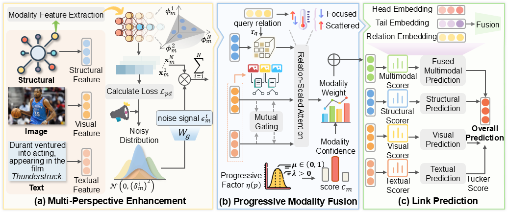

# PrismF
# More Perspectives, Stronger Signals: Multi-perspective enhancement and Progressive fusion for Multimodal Knowledge Graph Completion


## Introduction
Learning robust and fine-grained entity representations is essential for enhancing reasoning capabilities in multimodal knowledge graph completion (MMKGC). However, existing methods often struggle to extract discriminative intra-modal semantics and maintain balanced cross-modal interactions, especially under sparse or noisy conditions. To overcome these challenges, we propose PrismF, a novel framework that captures richer multimodal semantics through multi-perspective modeling and adaptive fusion. Specifically, we introduce a Multi-Perspective Enhancement (MuPE) module to extract diverse fine-grained features across different perspectives, and apply a Progressive Modality Fusion (PMF) mechanism to dynamically balance the contribution of each modality based on contextual confidence. Furthermore, we employ a decoupling constraint to preserve the representational diversity across perspectives and a  gating strategy to guide the cross-modal integration. Extensive experiments on three benchmark MMKG datasets validate the effectiveness of PrismF, achieving state-of-the-art performance in complex multimodal reasoning scenarios.


## Overview

<p align="center">
   
</p>

## Dependencies

-  Python==3.9
- numpy==1.24.2
- scikit_learn==1.2.2
- torch==2.0.0
- tqdm==4.64.1
- Maybe other library version also works.


## Data

The multi-model embedding of MMKGs are too large so you should download them from the [Google Drive Link](https://drive.google.com/file/d/1nRHdeWiVi9d_FKli3x7sO87ARasad39w/view?usp=sharing). Please unzip the embedding files and put them in the corresponding path in `datasets/`.


## Train
The full training scripts can be found in `scripts/train.sh`. For example, training on MKG-Y dataset:

##### MKG-Y dataset

```
python train.py --cuda 0 --lr 0.001 --mu 0.001 --dim 200 --dataset MKG-Y --epochs 2000
```
